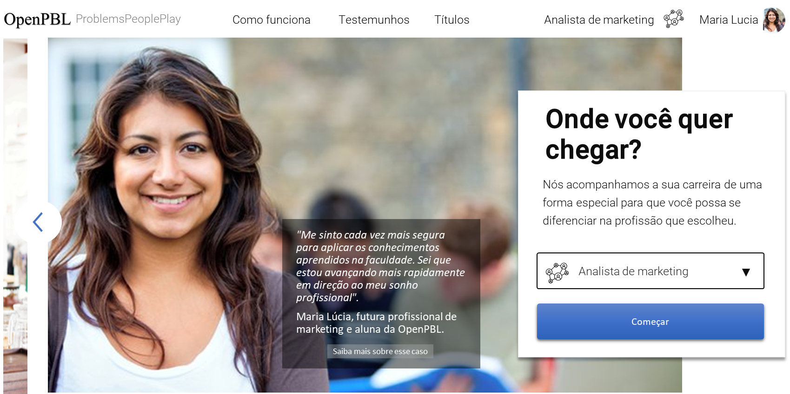

 

# Capacitação profissional OpenPBL  

<h3>Capacitação profissional que utiliza a metodologia da <b>Aprendizagem Baseada em Problemas</b> para acelerar o desenvolvimento de <b>competências comportamentais</b></h3> 

 

     <a href="#sobre">Sobre a OpenPBL</a>
     .
     <a href="#metodologia">Metodologia</a>
     .
     <a href="#projeto">Projeto</a>
     .
     <a href="#casos">Casos</a>     
     .
     <a href="#comercial">Condições comerciais</a>

  

   
  <a href="https://openpbl-school.github.io/Storytelling/#portuguese" target="_blank">Saiba mais sobre esse caso 3</a>  

  

## Sobre a OpenPBL (opcional white label)

A OpenPBL é… 

  

## Metodologia

**Profissional do futuro**

Conhecimentos e habilidades técnicas são importantes para que profissionais alcancem os resultados esperados por suas empresas, mas é o domínio de um conjunto de competências comportamentais que permite que estes profissionais o façam de forma eficiente, ou seja, menos dispendiosa e num prazo mais curto. 
À medida que mundo se torna mais globalizado, dinâmico e automatizado, o domínio destas competências tem se mostrado cada vez mais importante e já pode ser considerado o principal fator de diferenciação entre os profissionais. Entre as competências comportamentais mais valiosas no mundo corporativo, estão: a “tomada de decisão envolvendo incertezas”, a “tomada de decisão envolvendo restrições orçamentárias”, a “atuação em equipe sujeita à negociação”, a “atuação sob pressão de clientes”, e várias outras.

<Auxiliar>
Uma pesquisa publicada em 2018 pelo Fórum Econômico Mundial elencou as dez competências profissionais mais desejadas para os trabalhadores do futuro na opinião de gestores de RH de todo o mundo.   

**Desenvolvendo Competências Comportamentais** 

Usualmente, o desenvolvimento das competências comportamentais é um processo auto patrocinado, não supervisionado e executado de forma natural e inconsciente ao longo da carreira profissional. Esse "aprender na prática" é individualizado, pois cada um aprende do seu jeito, mas raramente de maneira estruturada, o que possibilitaria estabelecer padrões de qualidade para evitar distorções na passagem de conhecimento.
  
Entretanto, dependendo dos estímulos a que são submetidos os profissionais, este processo de desenvolvimento pode levar muito tempo para se concretizar ou, até mesmo, não se concretizar. 

Para acelerar e tornar mais assertivo este processo, alguns programas educacionais se propõem a abordar situações reais do dia-a-dia profissional em atividades de aprendizagem controlada para, assim, estimular o desenvolvimento individualizado destas competências. 

É o caso, por exemplo, das escolas que ofertam programas educacionais utilizando a Problem Based Learning - PBL (Aprendizagem Baseada em Problemas), uma estratégia de aprendizagem na qual os alunos aprendem resolvendo problemas e refletindo sobre suas experiências. 

Na PBL, esses problemas são apresentados aos alunos sob diversos formatos de experiências de aprendizagem, tais como estudos de caso, simulações, projetos, jogos e outras.   

**Metodologia** 

Ao contrário dos tradicionais cursos expositivos, o desenho instrucional e a execução de cursos e programas educacionais utilizando a PBL requer recursos especializados.  Não é raro encontrar programas PBL que empregam docentes treinados em metodologias ativas, infraestrutura de salas de aula específicas para a discussão em grandes grupos, investimentos em tecnologias de imersão e conteudistas especialistas na concepção estruturada de cenários de problemas. 

Essa peculiaridade da aprendizagem baseada em problemas eleva os custos do desenvolvimento de competências e restringe o acesso da maior parte dos profissionais ao método. Na prática, a PBL somente se demonstra viável para os níveis hierárquicos mais elevados, tais como o C-level e a alta gerência. 

Diante do desafio de “democratizar o acesso de profissionais de todos os níveis ao desenvolvimento de competências comportamentais”, a OpenPBL desenvolveu um método de ensino inovador que reduz substancialmente os custos de execução da PBL, sem, contudo, perder a sua eficácia educacional.

O método permite a execução de trilhas profissionalizantes específicas para as diversas funções corporativas, onde cada curso proporciona ao aluno uma experiência de aprendizagem completa baseada na discussão de problemas reais e típicos da sua carreira. 

Cada curso da trilha de carreira OpenPBL é composto de duas etapas:
- Uma etapa individual de preparação, com atividades online; e
- Uma sessão presencial de conclusão, conduzida por um tutor, com atividades em grupo. 

Ao final de cada curso da trilha, os alunos recebem o resultado comentado do seu desempenho.   

## Descrição do projeto de capacitação

**Objetivo e público alvo**

O objetivo do projeto educacional objeto desta proposta é acelerar o desenvolvimento de competências comportamentais profissionais em Consultores de Venda de nível Pleno, utilizando a metodologia da Aprendizagem Baseada em Problemas.

**Trilha de especialização**

O projeto prevê o desenvolvimento prévio de uma trilha de carreira, composta por 4 (quatro) cursos, onde cada um deles é projetado para proporcionar uma experiência de aprendizagem completa baseada na discussão de um problema real e típico da função de Consultor de Vendas B2B. 

Cada curso da trilha é dividido em duas etapas: (1) uma etapa individual de preparação, e (2) uma etapa de discussão em grupo.

Na etapa de preparação de cada curso, o aluno:
- Recebe o conteúdo descritivo do problema abordado no curso, bem como todo o material de apoio para o seu entendimento;
- É avaliado de forma adaptativa quanto ao seu nível de proficiência nos conhecimentos técnicos necessários para a análise e solução do problema;
- Recebe recomendações personalizadas de fontes de conteúdo para eliminar possíveis deficiências de conhecimento técnico;
- Ao final da etapa, propõe a sua solução (ou soluções) para o problema objeto do curso.

Na etapa de discussão, o aluno:
- Participa de uma sessão presencial de três horas com dez alunos, para discussões em torno do problema proposto no curso;
- A sessão é conduzida por um tutor especialista, via webconference.
- A sessão é realizada fora do ambiente corporativo, em ambiente especialmente projetado para dispor dos recursos educacionais necessários para o desenvolvimento de competências comportamentais.  

Como feedback da sua atuação em cada curso da trilha de carreira, o aluno recebe:
- Os resultados dos testes de conhecimento técnico que fez ao longo do curso;
- O registro audiovisual da sua participação na sessão presencial de discussões;
- A avaliação comentada do seu desempenho na solução do problema proposto no curso.

**Formatos das experiências de aprendizagem**  

Os problemas abordados nos cursos da trilha da carreira de Consultor de Vendas B2B serão apresentados aos alunos nos seguintes formatos:
- Estudos de caso (2); 
- Game de imersão (1); 
- Projeto-desafio (1).

**Objetivos de aprendizagem (Learning goals)** 

Cada curso da trilha de carreira se destina a acelerar o desenvolvimento de pelo menos duas competências comportamentais do conjunto elencado a seguir:
- Estruturação de problemas mal definidos;
- Tomada de decisão envolvendo incertezas e objetivos conflitantes;
- Tomada de decisão envolvendo restrições orçamentárias de recursos, restrições éticas e sujeitas à regras de compliance;
- Atuação sob pressão de prazo, desempenho e opiniões diversas;
- Atuação em equipe sujeita às dinâmicas de cooperação, competição, liderança e negociação;
- Visão orçamentária ,e atitude empreendedora.

As competências a serem desenvolvidas em cada curso da trilha serão escolhidas pela empresa contratante de uma lista sugerida pelo consultor especialista na carreira de Consultor de Vendas B2B que orientou o desenho da trilha.  

**Prazo de execução**
Cada

  

## Casos de sucesso

<nope> 
  
    

## Condições Comerciais

**Preço**

O valor do projeto educacional é de de R$ 375,00 por aluno por curso e a contratação é feita por turmas de 10 alunos. A contratação mínima é de uma turma.

**Condições Especiais** 

Volume

O valor total contratado terá uma bonificação por volume de **% para a contratação mínima de 3 turmas, mais uma bonificação adicional de **% para cada nova turma contratada para a mesma trilha de carreira. 

Prazo

O valor total contratado terá um desconto adicional de **% para a contratação até a data de &&/&&/&&&. 

**Forma de pagamento**

O pagamento deverá ser efetuado em três parcelas, conforme o cronograma físico-financeiro a seguir:
&& % no fechamento do contrato;
&& % ao final da execução de cada turma;
&& % ao final do projeto de capacitação;

**Prazo de entrega**

A entrega será… 

**Contrato**

Contrato padrão, pré-aprovado pelo jurídico da Estácio. 
Para evitar as demoras habituais dos departamentos jurídicos das empresas, a contratação será efetivada com a assinatura do cliente na proposta padrão.

...

